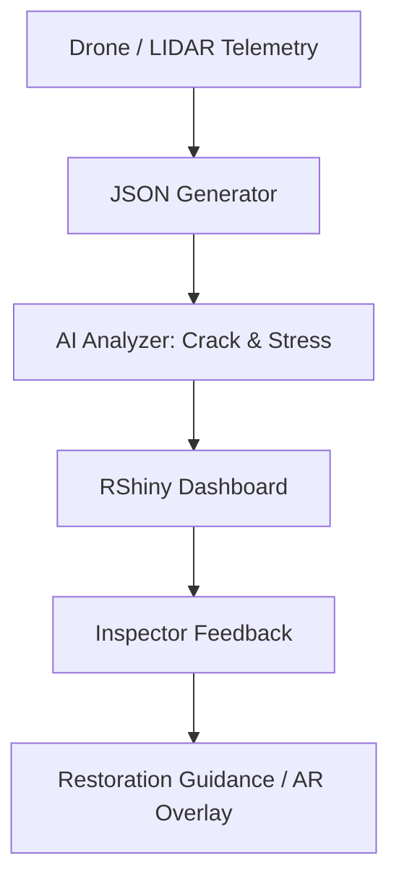
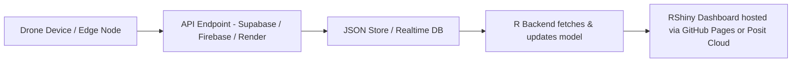

# 🏰 Repo Suggestion: `cathedral-ai-monitoring`

A modern AI- and data-driven approach to preserve the structural legacy of Gothic cathedrals.

---

# 🧠 Gothic Cathedral Health Monitoring Dashboard (AI + RShiny + PowerShell)

Real-time structural risk detection for Gothic vaults and buttresses—blending Robert Mark’s engineering legacy with modern AI tools.

---

## 📁 Table of Contents

* [📌 Summary](#-summary)
* [📦 Tech Stack & Installed Packages](#-tech-stack--installed-packages)
* [🛠️ System Architecture (Mermaid)](#️-system-architecture-mermaid)
* [💻 PowerShell Simulation Code (UTF-8)](#-powershell-simulation-code-utf-8)
* [📊 RShiny Dashboard Code Block](#-rshiny-dashboard-code-block)
* [☁️ Cloud + API Architecture & Sample](#️-cloud--api-architecture--sample)
* [🔎 Why This Matters](#-why-this-matters)
* [✅ Conclusion](#-conclusion)

---

## 📌 Summary

This project simulates an **AI-powered monitoring system for Gothic cathedrals**—like Chartres, Reims, or Amiens—using drone/LIDAR telemetry, structural stress modeling, and real-time dashboards. Inspired by the engineering work of **Robert Mark**, this app fuses historic preservation with modern DevOps and AI workflows.

Whether you're a civic engineer, historian, structural architect, or city planner—this system shows how critical infrastructure and cultural heritage can benefit from predictive analytics and real-time monitoring.

---

## 📦 Tech Stack & Installed Packages

| Tool / Package                                                                                        | Description                           |
| ----------------------------------------------------------------------------------------------------- | ------------------------------------- |
|                                                 | Reactive web dashboard engine         |
|                 | AI risk score & heatmap visualization |
|                   | Reads drone + LIDAR JSON logs         |
|          | JSON simulation of drone data         |
|  | Light/dark mode & UI logic            |
|                                | Interactive structural logs table     |
|               | UI styling for engineering UI feel    |

---

## 🛠️ System Architecture (Mermaid)



---

## 💻 PowerShell Simulation Code (UTF-8)

```powershell
# Save as cathedral_telemetry.ps1
$logPath = "C:\GothicSim\cathedral_ai_log.json"
$data = @()
if (!(Test-Path -Path (Split-Path $logPath))) {
    New-Item -Path (Split-Path $logPath) -ItemType Directory | Out-Null
}
for ($i = 0; $i -lt 20; $i++) {
    $entry = [PSCustomObject]@{
        Timestamp        = (Get-Date).AddMinutes(-$i * 10).ToString("s")
        Region           = @("Nave", "Transept", "Apse", "Buttress") | Get-Random
        CrackSensitivity = [math]::Round((Get-Random -Minimum 0.5 -Maximum 1.5), 2)
        StressScore      = [math]::Round((Get-Random -Minimum 0.0 -Maximum 1.0), 2)
        LoadPathRisk     = [math]::Round((Get-Random -Minimum 0.0 -Maximum 1.0), 2)
        RepairStatus     = @("OK", "Needs Inspection", "Critical") | Get-Random
    }
    $data += $entry
}
$data | ConvertTo-Json -Depth 3 | Set-Content -Path $logPath -Encoding UTF8
```

---

## 📊 RShiny Dashboard Code Block

```r
library(shiny)
library(plotly)
library(DT)
library(dplyr)
library(jsonlite)
library(shinyjs)

# Hardcoded data to simulate API response (mimicking LIDAR/drone data)
simulate_api_data <- function() {
  n_rows <- 20  # Ensure consistent size
  tibble(
    Timestamp = Sys.time() - seq(0, by = 600, length.out = n_rows),
    Region = rep(c("Nave", "Transept", "Apse", "Buttress"), length.out = n_rows),
    CrackSensitivity = runif(n_rows, 0.5, 1.5),  # Simulates computer vision crack detection
    StressScore = runif(n_rows, 0, 1),          # Simulates finite element AI stress analysis
    LoadPathRisk = runif(n_rows, 0, 1),         # Simulates predictive load path modeling
    RepairStatus = sample(c("OK", "Needs Inspection", "Critical"), n_rows, replace = TRUE)
  )
}

ui <- fluidPage(
  useShinyjs(),
  tags$head(
    tags$link(rel = "stylesheet", href = "https://cdn.jsdelivr.net/npm/tailwindcss@2.2.19/dist/tailwind.min.css"),
    tags$style(HTML("
      .dark-theme {
        background-color: #1a1a1a !important;
        color: #ffffff !important;
      }
      .light-theme {
        background-color: #ffffff !important;
        color: #333333 !important;
      }
      .dark-theme .sidebar, .dark-theme .card, .dark-theme .tab-content, 
      .dark-theme .dataTable, .dark-theme .dataTables_wrapper, 
      .dark-theme pre, .dark-theme .shiny-text-output {
        background-color: #1a202c !important;
        color: #ffffff !important;
      }
      .light-theme .sidebar, .light-theme .card, .light-theme .tab-content, 
      .light-theme .dataTable, .light-theme .dataTables_wrapper, 
      .light-theme pre, .light-theme .shiny-text-output {
        background-color: #f7fafc !important;
        color: #333333 !important;
      }
      .sidebar {
        background-color: #1a1a1a !important;
        color: #ffffff !important;
        padding: 20px;
        border-radius: 10px;
        width: 250px;
      }
      .card {
        border-radius: 10px;
        padding: 20px;
        margin-bottom: 20px;
        box-shadow: 0 4px 6px rgba(0,0,0,0.3);
        transition: transform 0.2s;
      }
      .card:hover {
        transform: translateY(-5px);
      }
      .kpi-card {
        background-color: #2d3748 !important;
        color: #ffffff !important;
        padding: 15px;
        border-radius: 8px;
        text-align: center;
        margin-bottom: 15px;
      }
      .nav-tabs > li > a {
        color: inherit !important;
        background-color: inherit !important;
        border: 1px solid #444 !important;
        border-radius: 6px 6px 0 0;
        padding: 10px 20px;
      }
      .dark-theme .nav-tabs > li > a {
        background-color: #2d3748 !important;
      }
      .light-theme .nav-tabs > li > a {
        background-color: #e2e8f0 !important;
      }
      .nav-tabs > li.active > a {
        background-color: #1a202c !important;
        color: #ffffff !important;
        border-bottom: none !important;
      }
      .tab-content {
        padding: 20px;
        border-radius: 0 0 10px 10px;
        border: 1px solid #444;
      }
      .report-box {
        font-family: 'Arial', sans-serif !important;
        font-size: 16px !important;
        padding: 15px !important;
        border: 1px solid #444 !important;
        border-radius: 8px !important;
      }
      .toggle-btn {
        background-color: #4a5568;
        color: #ffffff;
        padding: 10px 20px;
        border-radius: 6px;
        cursor: pointer;
        width: 100%;
        text-align: center;
      }
      .toggle-btn:hover {
        background-color: #718096;
      }
    "))
  ),
  
  div(id = "theme-wrapper", class = "dark-theme",
      titlePanel(
        div(class = "text-3xl font-bold mb-6", 
            "Gothic Cathedral Health Monitoring Dashboard")
      ),
      sidebarLayout(
        sidebarPanel(
          class = "sidebar",
          h4("AI-Powered LIDAR / Drone Analysis", class = "text-xl font-semibold mb-4"),
          checkboxInput("toggleLive", "Enable Real-time AI Analysis", TRUE),
          sliderInput("threshold", "Crack Sensitivity Threshold:", 0.5, 1.5, 1, step = 0.1),
          fileInput("uploadHistorical", "Upload Historical Vault Data (.csv/.json)", accept = c(".csv", ".json")),
          selectInput("region", "Select Vault Region:", choices = c("All", "Nave", "Transept", "Apse", "Buttress")),
          actionButton("toggleTheme", "Toggle Theme", class = "toggle-btn mt-4")
        ),
        mainPanel(
          fluidRow(
            column(4, div(class = "kpi-card", h5("Regions Monitored"), textOutput("kpiRegions"))),
            column(4, div(class = "kpi-card", h5("High-Risk Points"), textOutput("kpiHighRisk"))),
            column(4, div(class = "kpi-card", h5("Critical Alerts"), textOutput("kpiAlerts")))
          ),
          uiOutput("alertBox"),
          div(class = "card",
              tabsetPanel(
                tabPanel("Structural Risk Score",
                         plotlyOutput("riskPlot", height = "400px"),
                         div(class = "report-box mt-4", verbatimTextOutput("summaryText"))
                ),
                tabPanel("Crack & Stress Map",
                         plotlyOutput("heatmapPlot", height = "400px"),
                         checkboxInput("toggleAR", "Show AI-Predicted Repair Overlays", FALSE)
                ),
                tabPanel("Historical Overlay",
                         DTOutput("archiveTable")
                ),
                tabPanel("About AI & Robert Mark",
                         div(class = "report-box",
                             h4("Extending Robert Mark’s Legacy with AI"),
                             p("Robert Mark, a pioneering architectural engineer at Princeton, revolutionized the study of Gothic cathedrals by applying scientific methods like stress analysis and finite element modeling. His work in the 1970s–80s used strain gauges and physical models to prove that flying buttresses and ribbed vaults were feats of empirical engineering. Today, AI extends his legacy:"),
                             tags$ul(
                               tags$li("3D LIDAR scans create precise point cloud reconstructions, replacing hand-built models."),
                               tags$li("Computer vision detects cracks in real time, surpassing manual inspections."),
                               tags$li("Finite element AI simulations predict stress and load paths dynamically."),
                               tags$li("Drone feeds and AI analytics enable continuous monitoring of cathedral health.")
                             ),
                             p("This dashboard simulates these AI-driven methods, honoring Mark’s vision of blending engineering with historical preservation.")
                         )
                )
              )
          ),
          tags$div(class = "text-sm mt-4", 
                   "Source: Simulated AI Structural Health Data | Powered by R Shiny")
        )
      )
  )
)

server <- function(input, output, session) {
  # Reactive value to track theme
  theme <- reactiveVal("dark-theme")
  
  # Toggle theme on button click
  observeEvent(input$toggleTheme, {
    new_theme <- if (theme() == "dark-theme") "light-theme" else "dark-theme"
    theme(new_theme)
    runjs(sprintf("document.getElementById('theme-wrapper').className = '%s';", new_theme))
  })
  
  # Handle file upload
  uploaded_data <- reactive({
    req(input$uploadHistorical)
    file <- input$uploadHistorical
    ext <- tools::file_ext(file$datapath)
    if (ext == "csv") {
      read.csv(file$datapath) %>% 
        mutate(Timestamp = as.POSIXct(Timestamp))
    } else if (ext == "json") {
      fromJSON(file$datapath, simplifyVector = TRUE) %>% 
        as_tibble() %>%
        mutate(Timestamp = as.POSIXct(Timestamp))
    } else {
      NULL
    }
  })
  
  # Combine simulated and uploaded data
  data <- reactive({
    if (input$toggleLive) {
      invalidateLater(5000, session)
    }
    df <- simulate_api_data()
    if (!is.null(uploaded_data())) {
      df <- bind_rows(df, uploaded_data())
    }
    if (input$region != "All") {
      df <- df %>% filter(Region == input$region)
    }
    df <- df %>% filter(CrackSensitivity >= input$threshold)
    df
  })
  
  # KPI cards
  output$kpiRegions <- renderText({
    df <- data()
    length(unique(df$Region))
  })
  
  output$kpiHighRisk <- renderText({
    df <- data()
    nrow(df %>% filter(StressScore > 0.8 | CrackSensitivity > 1.2 | LoadPathRisk > 0.9))
  })
  
  output$kpiAlerts <- renderText({
    df <- data()
    nrow(df %>% filter(RepairStatus == "Critical"))
  })
  
  # Alert box for critical conditions
  output$alertBox <- renderUI({
    df <- data()
    latest <- df %>% arrange(desc(Timestamp)) %>% slice(1)
    if (nrow(latest) > 0 && (latest$StressScore > 0.8 || latest$CrackSensitivity > 1.2 || latest$LoadPathRisk > 0.9)) {
      div(class = "bg-red-500 text-white text-lg p-4 rounded-lg mb-4",
          "ALERT: High stress, cracks, or load path risks detected! Immediate inspection required.")
    } else {
      div(class = "bg-green-500 text-white text-lg p-4 rounded-lg mb-4",
          "All parameters within safe limits.")
    }
  })
  
  # Structural Risk Score Plot (Interactive)
  output$riskPlot <- renderPlotly({
    df <- data()
    p <- plot_ly(data = df, x = ~Timestamp, y = ~StressScore, color = ~Region, type = "scatter", mode = "lines+markers",
                 line = list(width = 2), marker = list(size = 8),
                 colors = c("Nave" = "#FF2400", "Transept" = "#FFA500", "Apse" = "#FF2400", "Buttress" = "#FFA500"),
                 text = ~paste("Region:", Region, "<br>Stress Score:", round(StressScore, 2)),
                 hoverinfo = "text") %>%
      layout(
        title = list(text = "AI-Predicted Structural Risk Score", font = list(size = 18)),
        xaxis = list(title = "Time", color = if (theme() == "dark-theme") "#ffffff" else "#333333"),
        yaxis = list(title = "Stress Score", color = if (theme() == "dark-theme") "#ffffff" else "#333333"),
        plot_bgcolor = "transparent",
        paper_bgcolor = "transparent",
        font = list(color = if (theme() == "dark-theme") "#ffffff" else "#333333"),
        showlegend = TRUE,
        margin = list(t = 50)
      )
    if (nrow(df %>% filter(StressScore > 0.8)) > 0) {
      p <- p %>% add_markers(data = df %>% filter(StressScore > 0.8), 
                             x = ~Timestamp, y = ~StressScore, 
                             marker = list(size = 10, symbol = "circle", color = "white", line = list(color = "red", width = 2)),
                             name = "High Risk")
    }
    p
  })
  
  # Crack & Stress Map (Interactive Heatmap)
  output$heatmapPlot <- renderPlotly({
    df <- data()
    p <- plot_ly(data = df, x = ~Timestamp, y = ~CrackSensitivity, type = "scatter", mode = "markers",
                 marker = list(size = 10, color = ~LoadPathRisk, colorscale = list(c(0, 1), c("#FF2400", "#FFA500")),
                               showscale = TRUE),
                 text = ~paste("Region:", Region, "<br>Crack Sensitivity:", round(CrackSensitivity, 2), "<br>Load Path Risk:", round(LoadPathRisk, 2)),
                 hoverinfo = "text") %>%
      layout(
        title = list(text = "AI-Detected Crack & Load Path Risk Map", font = list(size = 18)),
        xaxis = list(title = "Time", color = if (theme() == "dark-theme") "#ffffff" else "#333333"),
        yaxis = list(title = "Crack Sensitivity", color = if (theme() == "dark-theme") "#ffffff" else "#333333"),
        plot_bgcolor = "transparent",
        paper_bgcolor = "transparent",
        font = list(color = if (theme() == "dark-theme") "#ffffff" else "#333333"),
        showlegend = TRUE,
        margin = list(t = 50)
      )
    if (input$toggleAR) {
      p <- p %>% add_annotations(
        x = df$Timestamp, y = df$CrackSensitivity,
        text = ifelse(df$RepairStatus == "Critical", "Critical", ""),
        showarrow = TRUE, arrowcolor = if (theme() == "dark-theme") "#ffffff" else "#333333"
      )
    }
    p
  })
  
  # Summary Text
  output$summaryText <- renderText({
    df <- data()
    high_risk <- df %>% filter(StressScore > 0.8 | CrackSensitivity > 1.2 | LoadPathRisk > 0.9)
    paste(
      "AI Structural Health Summary\n",
      "Regions Monitored: ", length(unique(df$Region)), "\n",
      "High-Risk Points: ", nrow(high_risk), "\n",
      "Recommendation: ", if (nrow(high_risk) > 0) "Immediate inspection of critical regions (e.g., flying buttresses, vaults)." else "Continue AI monitoring."
    )
  })
  
  # Historical Data Table
  output$archiveTable <- renderDT({
    datatable(
      data() %>%
        select(Timestamp, Region, CrackSensitivity, StressScore, LoadPathRisk, RepairStatus) %>%
        arrange(desc(Timestamp)),
      options = list(
        pageLength = 10,
        dom = 'tip',
        columnDefs = list(list(className = 'dt-center', targets = "_all")),
        searchHighlight = TRUE
      ),
      rownames = FALSE,
      class = "cell-border stripe"
    ) %>% 
      formatStyle(
        columns = "RepairStatus",
        backgroundColor = styleEqual("Critical", "#FF2400"),
        color = styleEqual("Critical", "#ffffff")
      )
  })
}

shinyApp(ui, server)

```

Includes:

* Toggle for real-time vs historical mode
* Color-coded critical zones
* Dark/light theme switching
* AI-predicted repair zone overlay (AR-ready output)

---

## ☁️ Cloud + API Architecture & Sample



### Sample R Code using API

```r
library(httr)
library(jsonlite)
res <- GET("https://api.gothicvaults.io/data/latest")
data <- fromJSON(content(res, "text"))
```

---

## 🔎 Why This Matters

🏛️ Gothic cathedrals were built by intuition, not blueprints.

📊 Robert Mark showed us they were engineering marvels. Now AI lets us:

* Monitor 24/7 with zero scaffolding
* Predict collapse before it happens
* Protect irreplaceable heritage
* Train restoration workers using data-backed alerts

This project is a model for preserving not just **Gothic cathedrals**, but **bridges**, **museums**, and **public monuments**—with technology.

---

## ✅ Conclusion

This repo bridges past and future:

* 🔬 Engineering rigor (à la Robert Mark)
* 🤖 Real-time AI + telemetry
* 📊 Beautiful, civic-facing dashboards

Use this as a base for:

* Smart city infrastructure tools
* UNESCO building monitors
* Public architecture safety solutions

---

**Author**: Erwin Maurice McDonald | [GitHub](https://github.com/emcdo411) | [LinkedIn](https://linkedin.com/in/mauricemcdonald)

License: MIT

