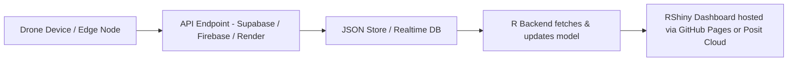

# 🧠 Gothic Cathedral Health Monitoring Dashboard (AI + RShiny + PowerShell)

Real-time structural risk detection for Gothic vaults and buttresses—blending Robert Mark’s engineering legacy with modern AI tools.

---

## 📁 Table of Contents

* [📌 Summary](#-summary)
* [📦 Tech Stack & Installed Packages](#-tech-stack--installed-packages)
* [🛠️ System Architecture (Mermaid)](#️-system-architecture-mermaid)
* [💻 PowerShell Simulation Code (UTF-8)](#-powershell-simulation-code-utf-8)
* [📊 RShiny Dashboard Code Block](#-rshiny-dashboard-code-block)
* [☁️ Cloud + API Architecture & Sample](#️-cloud--api-architecture--sample)
* [🔎 Why This Matters](#-why-this-matters)
* [✅ Conclusion](#-conclusion)

---

## 📌 Summary

This project simulates an **AI-powered monitoring system for Gothic cathedrals**—like Chartres, Reims, or Amiens—using drone/LIDAR telemetry, structural stress modeling, and real-time dashboards. Inspired by the engineering work of **Robert Mark**, this app fuses historic preservation with modern DevOps and AI workflows.

Whether you're a civic engineer, historian, structural architect, or city planner—this system shows how critical infrastructure and cultural heritage can benefit from predictive analytics and real-time monitoring.

---

## 📦 Tech Stack & Installed Packages

| Tool / Package                                                                                        | Description                           |
| ----------------------------------------------------------------------------------------------------- | ------------------------------------- |
|                                                 | Reactive web dashboard engine         |
|                 | AI risk score & heatmap visualization |
|                   | Reads drone + LIDAR JSON logs         |
|          | JSON simulation of drone data         |
|  | Light/dark mode & UI logic            |
|                                | Interactive structural logs table     |
|               | UI styling for engineering UI feel    |

---

## 🛠️ System Architecture (Mermaid)

```mermaid
flowchart TD
  A[Drone / LIDAR Telemetry] --> B[JSON Log File Generator (PowerShell)]
  B --> C[AI Model - Crack & Stress Analyzer (R)]
  C --> D[RShiny Dashboard Visualization]
  D --> E[Decision Maker: Engineer / Inspector]
  E --> F[Restoration Plan / AR Repair Guidance]
```

---

## 💻 PowerShell Simulation Code (UTF-8)

```powershell
# Save as cathedral_telemetry.ps1
$logPath = "C:\GothicSim\cathedral_ai_log.json"
$data = @()
if (!(Test-Path -Path (Split-Path $logPath))) {
    New-Item -Path (Split-Path $logPath) -ItemType Directory | Out-Null
}
for ($i = 0; $i -lt 20; $i++) {
    $entry = [PSCustomObject]@{
        Timestamp        = (Get-Date).AddMinutes(-$i * 10).ToString("s")
        Region           = @("Nave", "Transept", "Apse", "Buttress") | Get-Random
        CrackSensitivity = [math]::Round((Get-Random -Minimum 0.5 -Maximum 1.5), 2)
        StressScore      = [math]::Round((Get-Random -Minimum 0.0 -Maximum 1.0), 2)
        LoadPathRisk     = [math]::Round((Get-Random -Minimum 0.0 -Maximum 1.0), 2)
        RepairStatus     = @("OK", "Needs Inspection", "Critical") | Get-Random
    }
    $data += $entry
}
$data | ConvertTo-Json -Depth 3 | Set-Content -Path $logPath -Encoding UTF8
```

---

## 📊 RShiny Dashboard Code Block

```r
# Simulated input
fromJSON("C:/GothicSim/cathedral_ai_log.json") %>%
  mutate(Timestamp = as.POSIXct(Timestamp)) %>%
  filter(CrackSensitivity >= input$threshold)
```

Includes:

* Toggle for real-time vs historical mode
* Color-coded critical zones
* Dark/light theme switching
* AI-predicted repair zone overlay (AR-ready output)

---

## ☁️ Cloud + API Architecture & Sample



### Sample R Code using API

```r
library(httr)
library(jsonlite)
res <- GET("https://api.gothicvaults.io/data/latest")
data <- fromJSON(content(res, "text"))
```

---

## 🔎 Why This Matters

🏛️ Gothic cathedrals were built by intuition, not blueprints.

📐 Robert Mark showed us they were engineering marvels. Now AI lets us:

* Monitor 24/7 with zero scaffolding
* Predict collapse before it happens
* Protect irreplaceable heritage
* Train restoration workers using data-backed alerts

This project is a model for preserving not just **Gothic cathedrals**, but **bridges**, **museums**, and **public monuments**—with technology.

---

## ✅ Conclusion

This repo bridges past and future:

* 🔬 Engineering rigor (à la Robert Mark)
* 🤖 Real-time AI + telemetry
* 📊 Beautiful, civic-facing dashboards

Use this as a base for:

* Smart city infrastructure tools
* UNESCO building monitors
* Public architecture safety solutions

---

**Author**: Erwin Maurice McDonald | [GitHub](https://github.com/emcdo411) | [LinkedIn](https://linkedin.com/in/mauricemcdonald)

License: MIT
